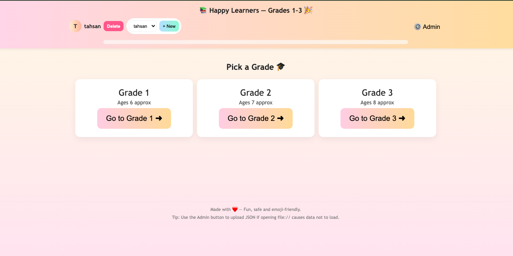
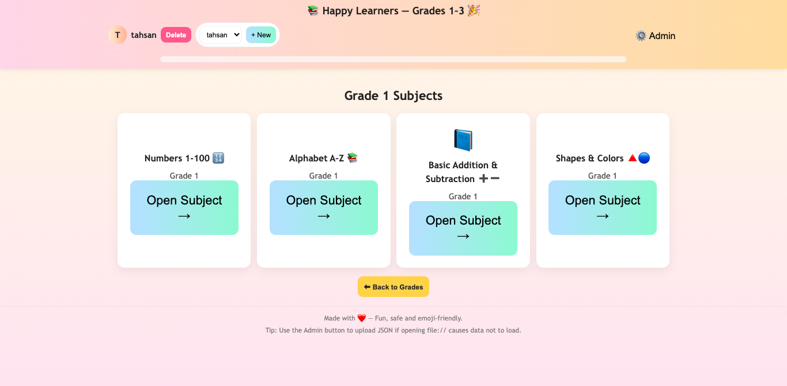
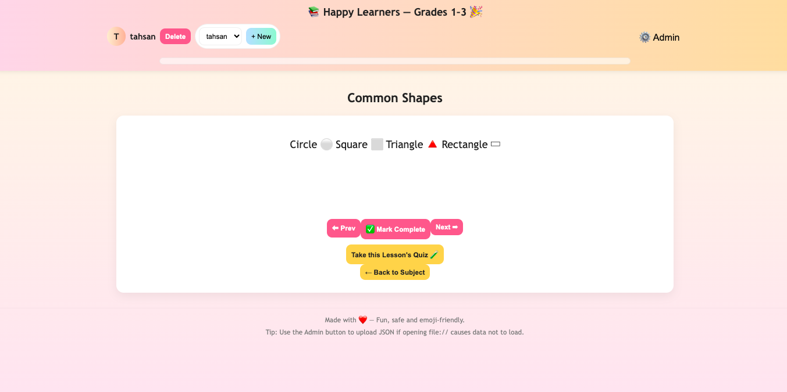
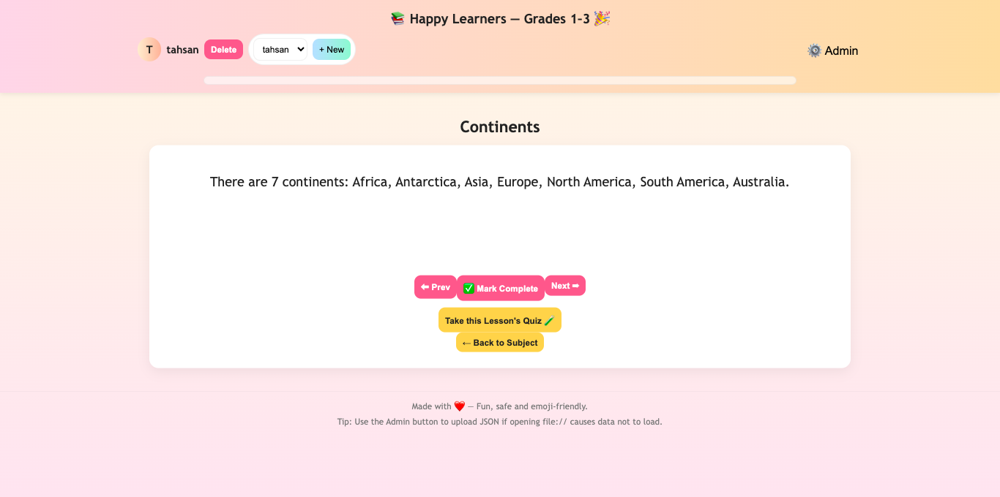
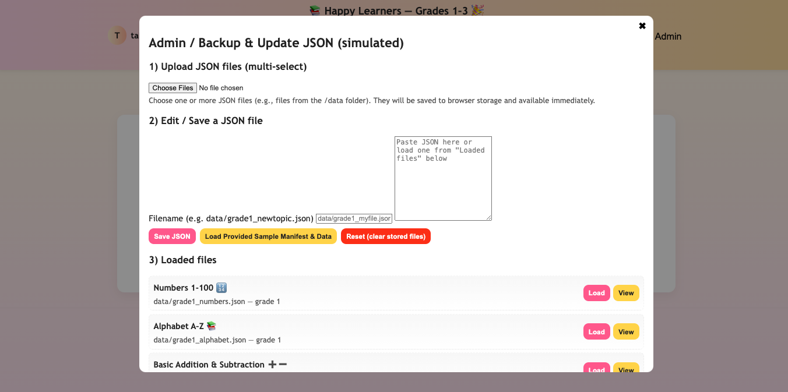

# Happy Learners — Web App for Kids (Grades 1–3) 🎉

Happy Learners is a fun, emoji-rich educational app for kids in Grades 1–3. It offers interactive lessons, quizzes, and progress tracking across multiple subjects like math, reading, and science. Features include user profiles, admin JSON upload, animations, sounds, and a fully responsive design — all built with vanilla JS, HTML, and CSS.

---

## Screenshots

### Main Menu - Grade Selection  

### Grade 2 Subjects  

### Lesson View with Progress Bar  

### Lesson View with Progress Bar  

### Exam Mode Quiz  

---

# and many more features
